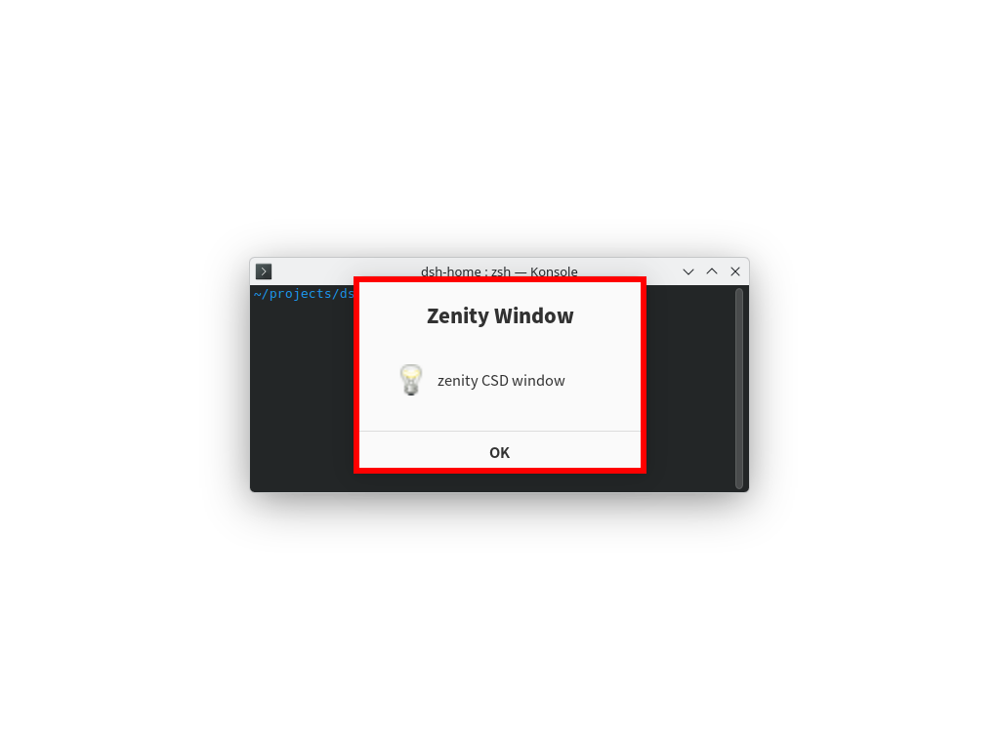
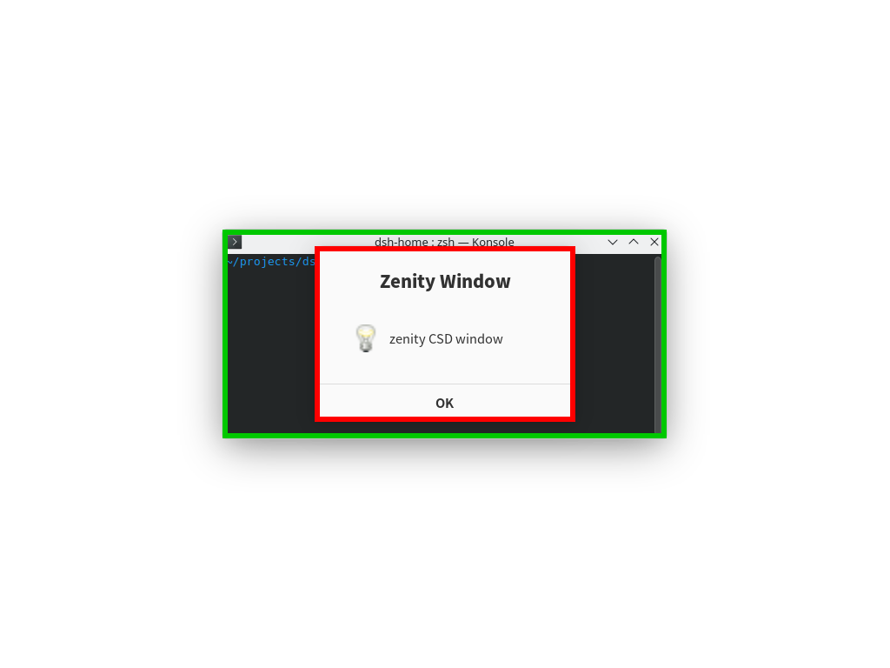

# Window Border — 给没有窗口装饰的窗口加边框的 KWin 效果插件

Wayland 会话下，很多窗口完全没有（或几乎没有）可见的窗口边界：

- GTK / libadwaita、Electron、**Tauri（WebKitGTK）** 等应用自己画 CSD 装饰，或者干脆设置 `decorations: false`；
- KWin 只会给「自己创建了服务端装饰」的窗口画标题栏和边框，这类 CSD 窗口对 KWin 来说就是一块光秃秃的矩形。

结果是：窗口和桌面背景、以及多个窗口互相之间难以分辨（尤其在平铺/重叠、深色壁纸或透明终端上）。

这个插件是一个 **KWin 合成器效果（Effect）**，在合成场景之上给窗口画一圈可配置的彩色边框：

- 默认**只给没有 KWin 装饰的窗口**画（也就是上面那类窗口），也可以配置成给所有窗口画；
- 默认**每个屏幕只给最前面的那个窗口**画（`TopmostPerScreen=true`）——这比"只给活动窗口画"稳定：鼠标移到另一块屏、或焦点变化都不会把边框带走。也可以用 `TopmostPerScreen=false` + `ActiveWindowOnly=true/false` 换成"只给活动窗口"或"所有窗口都画"；
- 被画边框的那个窗口可以用不同颜色、更粗的边框；
- 可选按应用派生不同颜色（提高多窗口辨识度）；
- 用户拖动/缩放窗口期间，以及窗口被动画做了几何变换的那些帧，不画边框（边框只会跟不上窗口、拖出残影）；
- **正确处理窗口遮挡**：边框被上层窗口盖住的部分不会被画出来（不会出现下层的边框糊在上层窗口上的问题）；
- 支持 OpenGL 合成和 QPainter（软件）合成两种后端。



上图是**默认配置**（`BorderOnDecoratedWindows=false`）：zenity 是 GTK/CSD 窗口（KWin 没有给它装饰），所以画了红框；konsole 有自己的服务端装饰，因此不画。



上图是 `BorderOnDecoratedWindows=true` + `ActiveWindowOnly=false` 时的效果：绿色 = 非活动窗口，红色 = 活动窗口，且下层窗口被上层窗口遮住的部分不会被画出来。

（截图来自嵌套 KWin 虚拟输出，用 zenity 作为 CSD 窗口、konsole 作为有装饰窗口测试。）

## 为什么不写 KWin 脚本

KWin Script（JavaScript）只能读/改窗口几何、调用 API，**没有绘制能力**，无法在屏幕上画边框。画东西必须写二进制效果插件（C++）。所以这里是一个 C++/Qt6 的 Effect 插件。

## 环境要求

- KWin **6.7**（本插件按 6.7.5 的 effect API 编写，KWin 每次大版本升级后需要重新编译）；
- 构建依赖（KDE neon / Ubuntu 系）：

```bash
sudo apt install kwin-dev kf6-extra-cmake-modules qt6-declarative-dev ninja-build cmake g++
```

## 构建与安装

```bash
cmake -B build -G Ninja -DCMAKE_BUILD_TYPE=Release -DCMAKE_INSTALL_PREFIX=/usr
cmake --build build
sudo cmake --install build
```

安装位置是 Qt 插件目录下的 KWin 效果目录：

```
/usr/lib/x86_64-linux-gnu/qt6/plugins/kwin/effects/plugins/windowborder.so
```

> 注意：KWin 只扫描 Qt 的插件搜索路径（标准系统目录 + `QT_PLUGIN_PATH`）。如果安装到 `/usr/local` 或 `~/.local`，需要把对应目录加入 `QT_PLUGIN_PATH`（例如写进 `~/.config/plasma-workspace/env/*.sh` 后重新登录），否则 KWin 找不到插件。

## 启用 / 禁用

装好之后（系统目录安装无需重新登录）：

```bash
# 立即加载并写入配置，下次登录自动启用
tools/kwin-windowborder-setup.sh enable

# 关闭
tools/kwin-windowborder-setup.sh disable

# 查看当前配置
tools/kwin-windowborder-setup.sh status
```

等价的手工命令（注意：**已经在运行的实例不会因为覆盖 .so 而更新**，必须 `unloadEffect` 之后再 `loadEffect`，否则跑的还是旧代码）：

```bash
kwriteconfig6 --file kwinrc --group Plugins --key windowborderEnabled true
qdbus6 org.kde.KWin /Effects org.kde.kwin.Effects.unloadEffect windowborder
qdbus6 org.kde.KWin /Effects org.kde.kwin.Effects.loadEffect windowborder
```

启用后可以在「系统设置 → 桌面效果（Desktop Effects）」里找到 **Window Border / 窗口边框**。

## 配置项

配置文件 `~/.config/kwinrc`，组 `[Effect-windowborder]`：

| 键 | 默认值 | 说明 |
| --- | --- | --- |
| `Enabled` | `true` | 效果总开关（不卸载插件也能临时停用） |
| `BorderWidth` | `2` | 边框粗细（像素），`0` 表示不画 |
| `ActiveBorderWidth` | `0` | 活动窗口边框粗细，`0` 表示与 `BorderWidth` 相同 |
| `BorderPlacement` | `inside` | 边框位置：`inside`（窗口内缘）/ `center`（骑在边缘上）/ `outside`（窗口外缘） |
| `ActiveColor` | `#3daee9` | 活动窗口颜色（`#RRGGBB` 或 `#AARRGGBB`） |
| `InactiveColor` | `#80000000` | 非活动窗口颜色；默认半透明黑，注意 `#80000000` 是 AARRGGBB（alpha=0x80） |
| `BorderOnDecoratedWindows` | `false` | 是否也给「有 KWin 装饰」的窗口画边框（`false` = 只处理没有装饰的窗口） |
| `TopmostPerScreen` | `true` | 每个屏幕只给最前面（栈顶）的那个窗口画边框。它由窗口栈序决定，和"当前活动窗口"无关，所以鼠标在两块屏之间移动不会把边框带走 |
| `ActiveWindowOnly` | `true` | 仅在 `TopmostPerScreen=false` 时生效：只给当前活动窗口画边框（`false` = 所有窗口都画） |
| `ExcludeFullScreen` | `true` | 全屏窗口不画 |
| `ExcludeMaximized` | `false` | 最大化窗口不画 |
| `HideWhileMoving` | `true` | 用户拖动/缩放窗口期间不画边框（拖动时边框跟不上窗口，只会拖出一条条残影） |
| `PerWindowColors` | `false` | 按应用名（windowClass）派生不同色相，非活动窗口各用一色 |

示例：

```bash
tools/kwin-windowborder-setup.sh set BorderWidth 3
tools/kwin-windowborder-setup.sh set ActiveColor '#00d1ff'
tools/kwin-windowborder-setup.sh set InactiveColor '#60000000'
tools/kwin-windowborder-setup.sh set BorderOnDecoratedWindows true
tools/kwin-windowborder-setup.sh set PerWindowColors true
tools/kwin-windowborder-setup.sh set HideWhileMoving false
```

或者直接改 `kwinrc` 后执行：

```bash
qdbus6 org.kde.KWin /KWin reconfigure
```

## 卸载

```bash
tools/kwin-windowborder-setup.sh disable
sudo rm /usr/lib/x86_64-linux-gnu/qt6/plugins/kwin/effects/plugins/windowborder.so
```

## 已知限制

- 边框是**直角矩形**，不跟随窗口自身的圆角；带圆角的 CSD 窗口四角可能有一两个像素的方形痕迹。
- 用户拖动/缩放窗口期间不画边框（`HideWhileMoving`）；被动画/特效做了几何变换的窗口（最大化动画、wobbly windows 等）当帧也不画，因为这时窗口画在哪儿和 `frameGeometry()` 不一致，画出来只会错位。
- Overview / Desktop Grid / Zoom 等全屏效果、以及整个屏幕被变换（桌面滑动切换等）的当帧，本效果自动停止绘制（否则位置会错）。
- 遮挡是**按窗口矩形**近似计算的，不考虑不规则窗口形状和半透明区域（透明度 > 0.5 的上层窗口视为遮挡）。
- 只对普通窗口（Normal / Dialog / Utility）生效；桌面、面板、菜单、通知、工具提示等不画。

## 目录结构

```
CMakeLists.txt                       构建脚本
src/windowborder.h / .cpp            效果实现
src/main.cpp                         插件工厂（KWIN_EFFECT_FACTORY）
src/windowborder.json                插件元数据（System Settings 里显示的名称等）
tools/kwin-windowborder-setup.sh     启用/禁用/配置辅助脚本
docs/example.png                     效果截图（所有窗口都画）
docs/example-undecorated-only.png    效果截图（默认：只画无装饰窗口）
```

## 许可

GPL-2.0-or-later（与 KWin 插件接口要求一致）。
